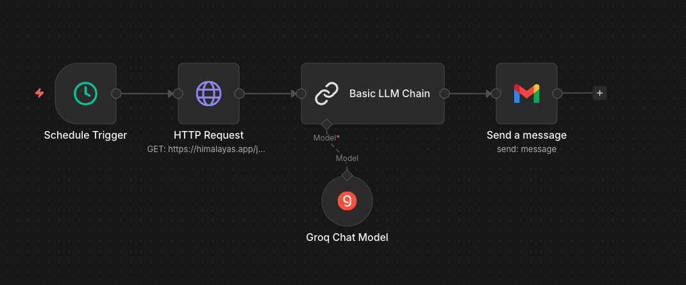
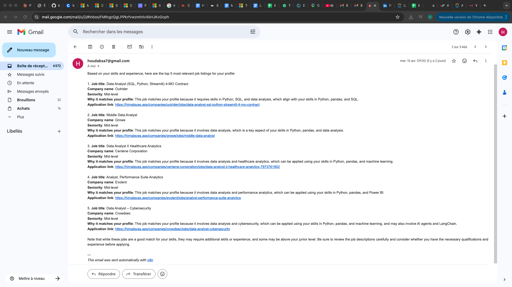

# AI Adoption Portfolio

Practical AI projects combining LLMs, agents, and workflow automation.

---

## Projects

### 1. Automated Job Finder — n8n + Groq
**`workflow/job_finder_workflow.json`**

A fully automated n8n workflow that runs every morning at 9am, fetches live job listings, and emails the top 5 matches for my profile.

**How it works:**
1. **Schedule Trigger** — runs daily at 9am
2. **HTTP Request** — fetches data analyst job listings from Himalayas API (France, 20 results)
3. **Groq LLM (LLaMA 3.3 70B)** — ranks and selects the top 5 most relevant jobs based on my skills profile
4. **Gmail** — sends a formatted email with job titles, companies, seniority, match reasoning, and application links

**Tech:** n8n · Groq API · LLaMA 3.3 70B · Gmail integration

**To import:** Open n8n → New Workflow → Import from file → select `workflow/job_finder_workflow.json`

**Workflow:**


**Sample Gmail output:**


---

### 2. LangChain Pandas Agent
**`langchain_pandas_agent.ipynb`**

A LangChain agent that answers natural language questions about a retail dataset. Ask "What are the top 5 products by revenue?" and get an answer — no SQL, no manual filtering.

**Tech:** LangChain · Groq (LLaMA 3.3 70B) / Anthropic Claude · Pandas

---

## Setup

```bash
git clone https://github.com/bensidiahmedhouda-collab/ai-adoption-portfolio.git
cd ai-adoption-portfolio

pip install langchain langchain-groq langchain-anthropic langchain-experimental pandas openpyxl python-dotenv
```

Create a `.env` file:
```
GROQ_API_KEY=your_key_here
ANTHROPIC_API_KEY=your_key_here
```

Get a free Groq API key at [console.groq.com](https://console.groq.com).

---

## Skills Demonstrated

- **LLM integration** — Groq and Anthropic APIs
- **AI agents** — LangChain tool-using agents over structured data
- **Workflow automation** — n8n with LLM nodes, HTTP requests, and Gmail
- **Prompt engineering** — structured output from unstructured job listings
